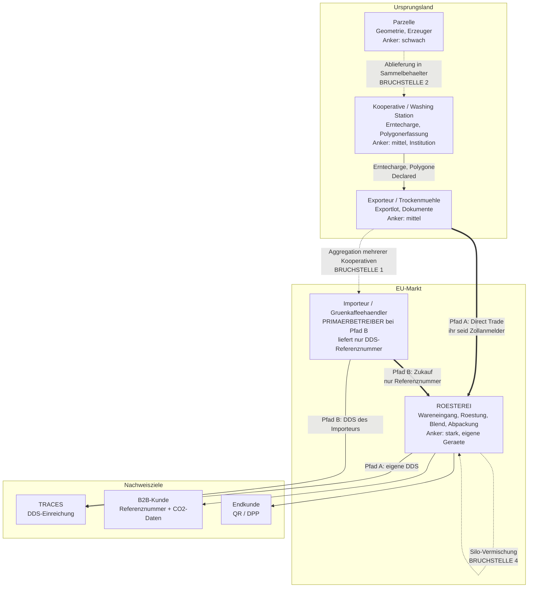
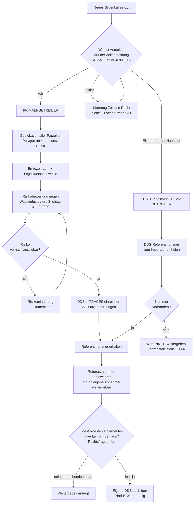
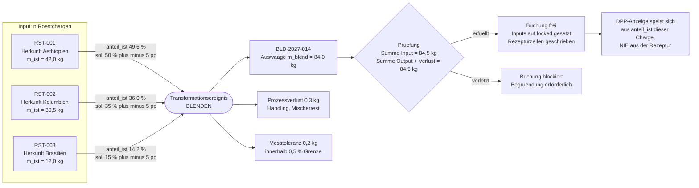
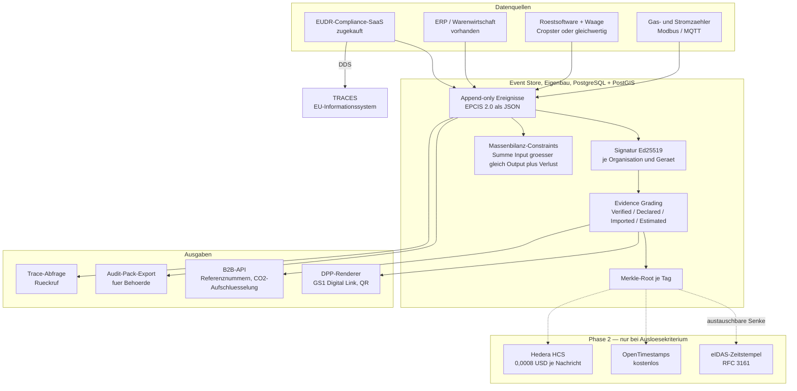

# Diagramme

Vier Mermaid-Diagramme. Sie rendern in GitHub, GitLab und jedem Markdown-Viewer mit Mermaid-Unterstützung.

---

## 1. Datenfluss vom Erzeuger zum Endkunden, mit Vertrauensankern

Jeder Knoten trägt die Belastbarkeit seines Vertrauensankers im Label. Gestrichelte Kanten markieren die vier Stellen, an denen die Kette in der Praxis bricht; doppelte Kanten den Warenfluss zu euch.

**Lesehilfe:** Die vier Bruchstellen sind in `02-stakeholder-und-prozesse.md`, Abschnitt 3 erläutert. Kein Ledger repariert sie — er dokumentiert sie nur unveränderlich.

---

## 2. EUDR-Rollenentscheidung je Lot

Die Entscheidung fällt **je Lot**, nicht je Unternehmen. Bei Mischform-Beschaffung laufen beide Zweige parallel.

**Hinweis:** Der Zweig `OFFEN` ist die in `01-regulatorik.md`, Abschnitt 2.4 beschriebene ungeklärte Rechtsfrage. Das Datenmodell trägt beide Ausgänge.

---

## 3. Massenbilanz beim Blenden — n zu 1 mit Verlust

**Kernregeln:** Inputs werden gesperrt, nicht gelöscht. `anteil_ist` ist die Wahrheit, `anteil_soll` nur Abweichungskontrolle. Details in `05-massenbilanz-und-token.md`.

---

## 4. Systemarchitektur Option B — die Empfehlung

Die gestrichelte Box ist Phase 2 und wird nur bei Eintritt eines Auslösekriteriums aktiviert. Sie hängt an einer austauschbaren Senke.

**Die eine Architekturvorgabe, die Phase 1 aus Phase 2 mitnehmen muss:** Der Merkle-Root wird immer gebildet, die Senke bleibt austauschbar. Der Wechsel von einer Zeitstempelstelle auf einen Ledger ist dann Konfiguration, kein Umbau. Begründung in `04-architektur-optionen.md`, Abschnitt 2.
